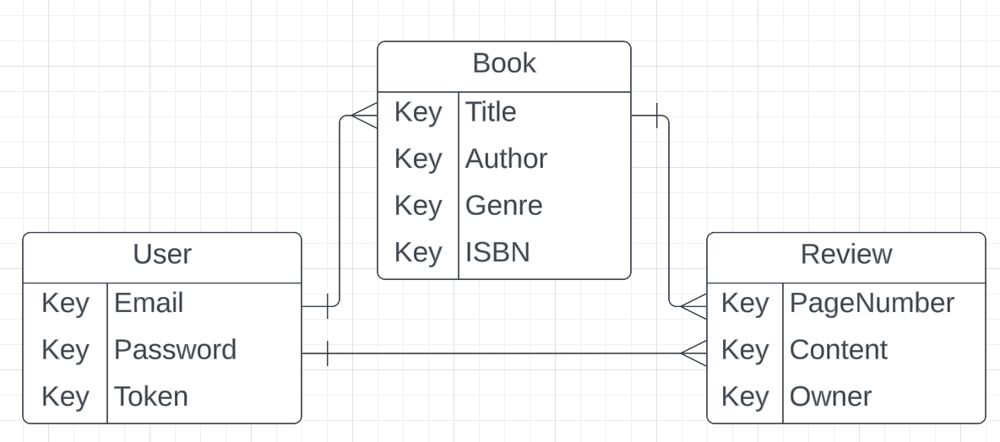

# ShelfBuddi
Does your large collection of books overwhelm you? Do you want to read your unread books before buying more? ShelfBuddi can help you achieve your reading goals. This app allows you to log your book collection into one place to categorize and organize as you read through your book shelf.

## MVP
* As the user I want to be able to make an account
* As the user I want to be able to sign-in
* As the user I want to be able to log each individual book
* As the user I want to be able to see all my books on a shelf
* As the user I want to be able to update my progress in a book
* As the user I want to be able to delete a book from my shelf
* As the user I want to be able to write a review for a book I have finished
* As the user I want to be able to see the review when I click the book
* As the user I want to be able to update a review if my opinion changes
* As the user I want to be able to delete a review entirely

### Version 2
* As the user I want to be able to see the book covers for each book when I log it
* As the user I want to be able to categorize the logged books so I can filter by different fields
* As the user I want to be able to mark a book "read" so I see what I have left unread
* As the user I want to be able to see the books marked "read" move to a different shelf to separate the read from the unread
* As the user I want to be able to create a favorites list

### Version 3
* As the user I want to be able to change the color scheme of my book shelf
* As the user I was to be able to share my book reviews on social media
* As the user I would like to be able to have a five-star rating system for book reviews
* As the user I want to have a function where I can just scan the ISBN and it generates the book informtion

## ERD

